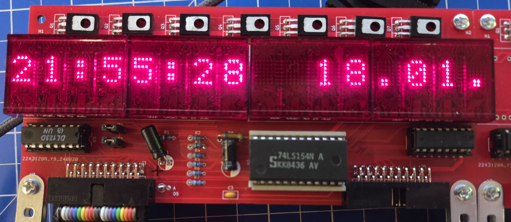

# VQC10
DDR LED Punkt-Matrix-Display VQC10 (Leiterplatte und Code)

## Gehäuse
* folgt noch

## Leiterplatte
* KiCAD 9 Projekt

## Literatur
* Datenblatt
* Schaltungen aus der rfe

## Software
Für den Raspberry Pi Pico
  
### Arduino Code
* auf Basis von https://github.com/versioduo/VQC10
* Vor Compilierung Example Datei und Files aus scr Verzeichnis in ein gemeinsames Verzeichnis verschieben

### Micropython Code
* auf Basis von https://github.com/versioduo/VQC10

