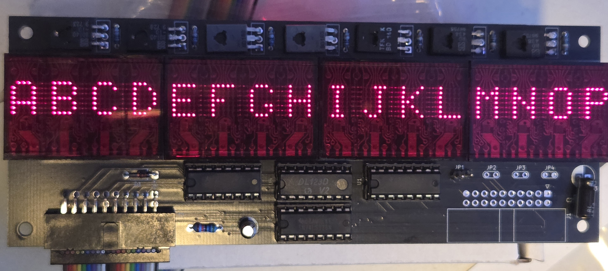
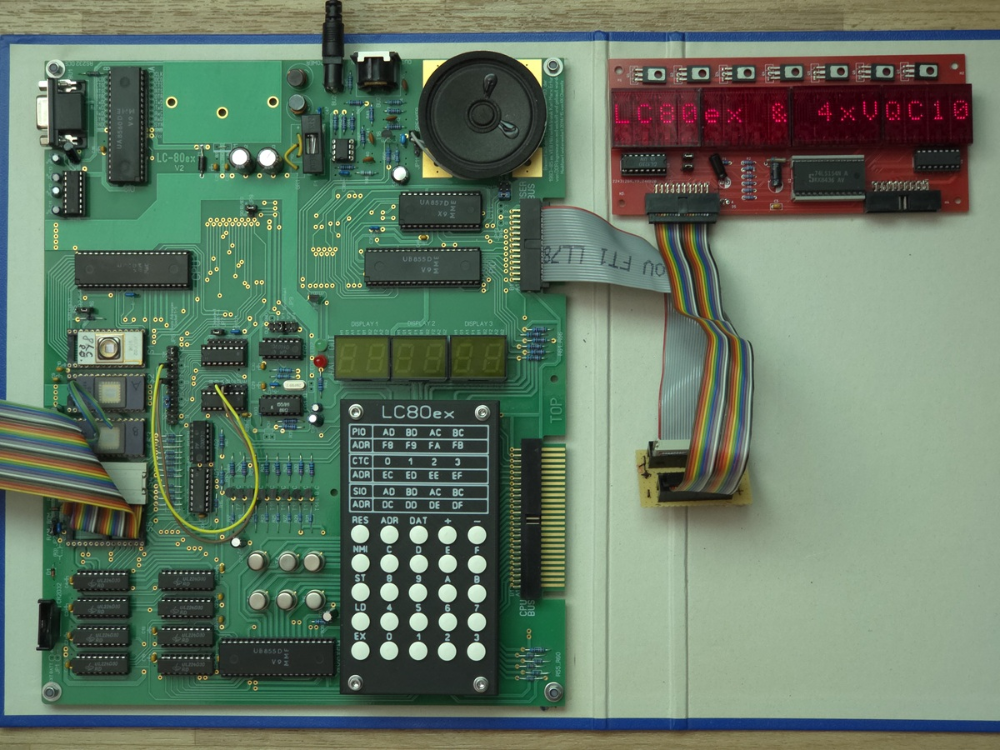
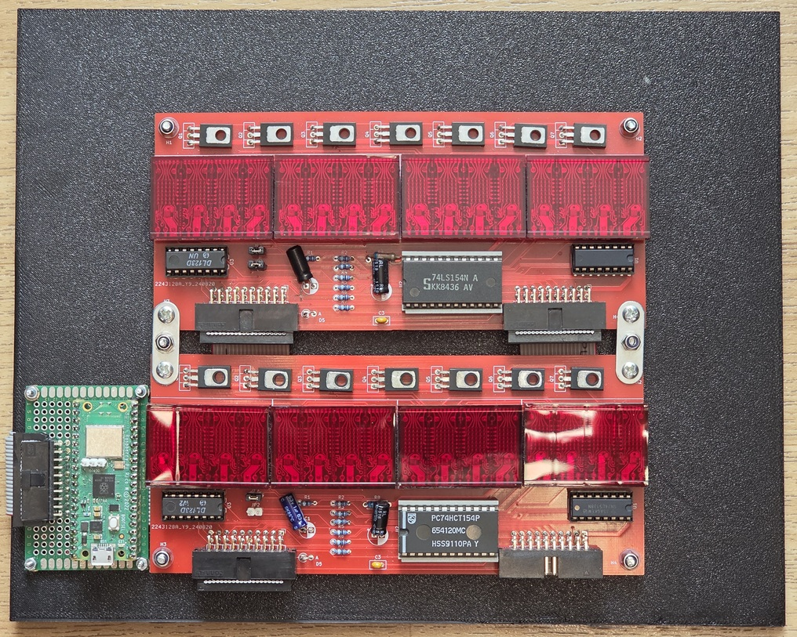

# VQC10
DDR (WF) Punkt-Matrix-LED-Display VQC10 (Leiterplatte und Code)

Version 1

Version 2

## Leiterplatte Version 2
### Platine
* Farbe der Platine V.1 auf den Bildern: rot
* Farbe der Platine V.2 auf den Bildern: schwarz
* KiCAD 9 Projekt
* Die Platinen sind nebeneinander anreihbar und es können bis zu 4 Stück kaskadiert werden.
* Ab der 2. Platine geht es mit Flachbandkabel zur nächsten Platine. 
* Jede Platine wird über eine eigene Leitung (SD4-SD7) aktiviert. Die Auswahl erfolgt über die 4 Jumper.

### Halbleiterbauelemente
* 4 x VQC 10 (4-Digit-Punkt-Matrix-LED-Displays) 
* 3 x 74LS138 (1-aus-8 Dekoder für Zeilen und 1-aus-16 Dekoder für Digits)
* 1 x 74LS123 (Schutzschaltung)
* 7 x BD140 (Zeilentreiber)

### Anschlüsse Leiterplatte Version 1
**An 20 pol. Steckerleiste:**
* ZD0 - ZD2 (3): Zeilendecoder (U1, 74HCT138)
* SD0 - SD3 (4): Stellendecoder (U2, U3, 2x 74HCT138)
* SD4 - SD7 (4): Selektierung der Stellendecoder über Jumper (Low-Aktiv)
* D1-D5 (5): Daten (Zeilen)

**Belegung der Anschlüsse:**
| Pin | Belegung | Raspberry Pi Pico | LC80ex | Pin LC80-Userport |
|-----|----------|-------------------|--------|-------------------|
| 1   | +5 V     | +5 V              | +5 V   | 26                |
| 2   | +5 V     | +5 V              | +5 V   | 25                |
| 3   | SD0      | GP20              | PB0    | 16                |
| 4   | ZD0      | GP15              | PA0    | 21                |
| 5   | SD1      | GP19              | PB1    | 18                |
| 6   | ZD1      | GP14              | PA1    | 19                |
| 7   | SD2      | GP18              | PB2    | 20                |
| 8   | ZD2      | GP12              | PA2    | 17                |
| 9   | SD3      | GP17              | PB3    | 22                |
| 10  | D1       | GP28              | PA3    | 7                 |
| 11  | SD4      | GP16              | (Masse)| -                 |
| 12  | D2       | GP27              | PA4    | 9                 |
| 13  | SD5      | GP10              | (Masse)| -                 |
| 14  | D3       | GP26              | PA5    | 11                |
| 15  | SD6      | GP9               | (Masse)| -                 |
| 16  | D4       | GP22              | PA6    | 13                |
| 17  | SD7      | GP8               | (Masse)| -                 |
| 18  | D5       | GP21              | PA7    | 15                |
| 19  | Masse    | Masse             | Masse  | 1                 |
| 20  | Masse    | Masse             | Masse  | 2                 |

### Selektion der 4 Leiterplatten
SD4-7 müssen zur Selektierung Low und der jeweilige Jumper geschlossen sein:
| Leiterplatte | Jumper | Pin (J1/J2) | Belegung | Port-Pin (Raspberry Pi Pico) |
|---|-----|----|-----|------|
| 1 | JP1 | 11 | SD4 | GP16 |
| 2 | JP2 | 13 | SD5 | GP10 |
| 3 | JP3 | 15 | SD6 | GP9 |
| 4 | JP4 | 17 | SD7 | GP8 |

**Leiterplatte 1:** 
* Jumper JP1 geschlossen
* Jumper JP2 geöffnet
* Jumper JP3 geöffnet
* Jumper JP4 geöffnet

**Leiterplatte 2:**
* Jumper JP1 geöffnet
* Jumper JP2 geschlossen
* Jumper JP3 geöffnet
* Jumper JP4 geöffnet

**Leiterplatte 3:**
* Jumper JP1 geöffnet
* Jumper JP2 geöffnet
* Jumper JP3 geschlossen
* Jumper JP4 geöffnet

**Leiterplatte 4:**
* Jumper JP1 geöffnet
* Jumper JP2 geöffnet
* Jumper JP3 geöffnet
* Jumper JP4 geschlossen

## Literatur
* Datenblatt
* Schaltungen aus der rfe

## Simulation
* Simulation von 1x VQC10 mit Z80 unter SimulIDE
* https://simulide.com/

## Software
### Arduino Code
* Für den Raspberry Pi Pico
* auf Basis von https://github.com/versioduo/VQC10
* Vor Compilierung Example Datei und Files aus scr Verzeichnis in ein gemeinsames Verzeichnis verschieben

### Micropython Code
* Für den Raspberry Pi Pico

### Z80-Assembler
#### aZ80/RC2016-Computer

4x VQC10 am aZ80 Computer

Benutzte Entwicklungssoftware:
* "Small Computer-Monitor"
* https://smallcomputercentral.com/small-computer-monitor/

#### LC80ex

Test mit dem Nachbau des DDR-Platinen Computers LC80 

#### Z1013
ToDo

## Gehäuse

Grundplatte für IKEA Bilderrahmmen "VÄSTANHED 20x25 cm" mit Leiterplatten der Version 1
* STL Datei für 3D-Druck: "Gehäuse/2xVQC10_Grundplatte1.stl"
