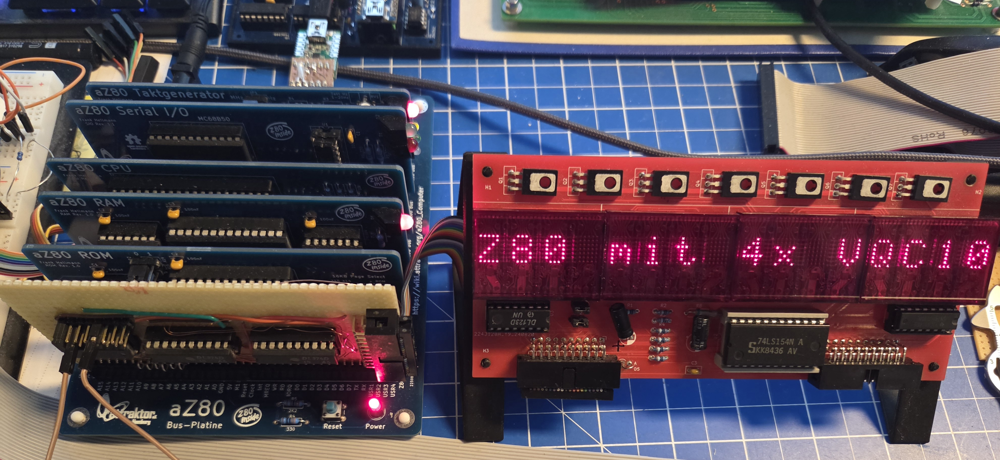

# VQC10
DDR LED Punkt-Matrix-Display VQC10 (Leiterplatte und Code)

4x VQC10 am aZ80 Computer

## Gehäuse
* folgt noch

## Leiterplatte
* KiCAD 9 Projekt
* Die Platinen sind nebeneinander anreihbar und es können 4 Stück kaskadiert werden.
* Ab der 2. Platine geht es mit Flachbandkabel zur nächsten Platine. 
* Jede bekommt eine eigene Adresse über die 2 Jumper.

**=== ACHTUNG ===**
* Das Layout wird noch überarbeitet, da Widerstände für die Kaskadierung fehlen! 
* Außerdem stimmen die Abstände bei dem VQC10 Footprint nicht!

## Literatur
* Datenblatt
* Schaltungen aus der rfe

## Simulation
* Simulation von 1x VQC10 mit Z80 mit SimulIDE
* https://simulide.com/

## Software
### Arduino Code
* Für den Raspberry Pi Pico
* auf Basis von https://github.com/versioduo/VQC10
* Vor Compilierung Example Datei und Files aus scr Verzeichnis in ein gemeinsames Verzeichnis verschieben

### Micropython Code
* Für den Raspberry Pi Pico

### Z80-Assembler
#### aZ80/RC2016-Computer

Benutzte Entwicklungssoftware:
* "Small Computer-Monitor"
* https://smallcomputercentral.com/small-computer-monitor/
 
#### LC80ex
* Test mit dem Nachbau des DDR-Platinen Computers LC80 

#### Z1013
* ToDo

